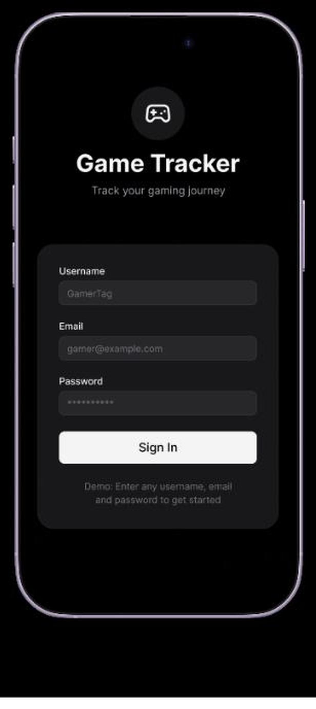
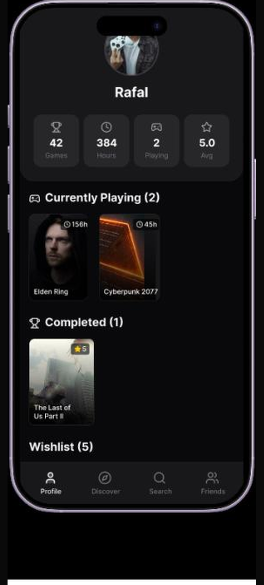
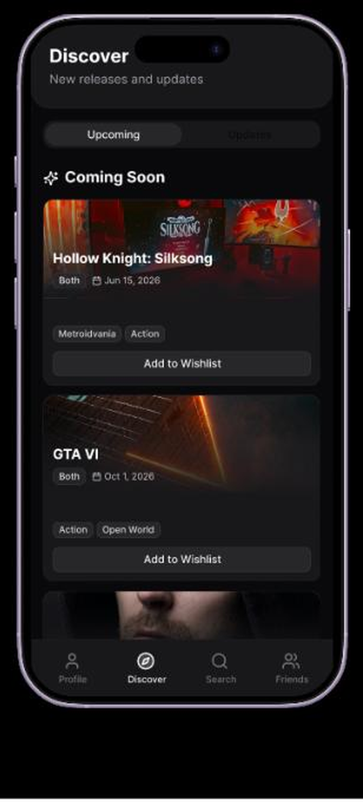
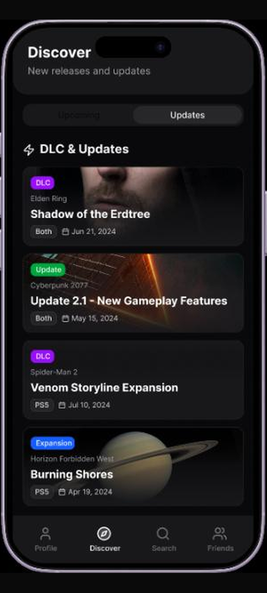
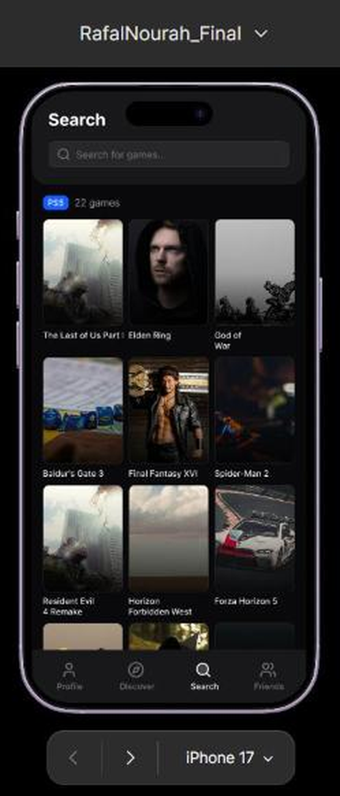
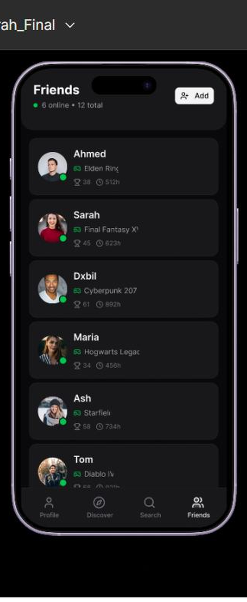
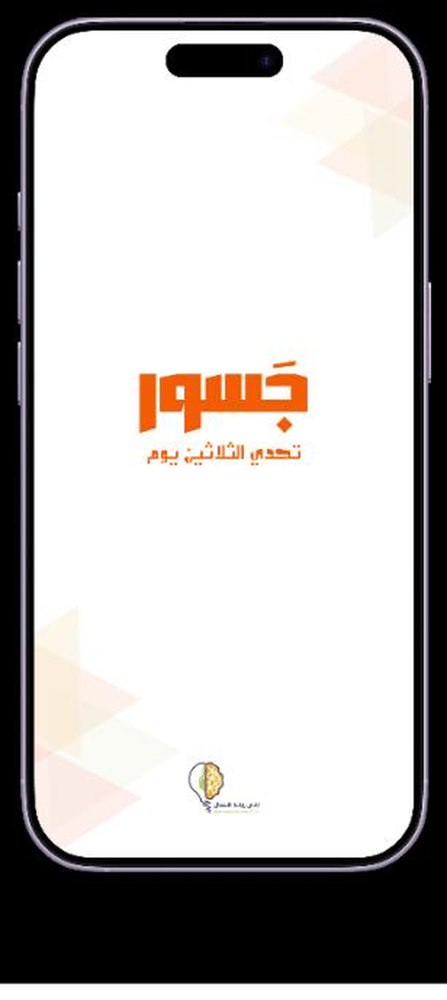
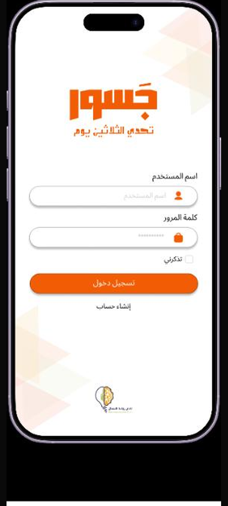
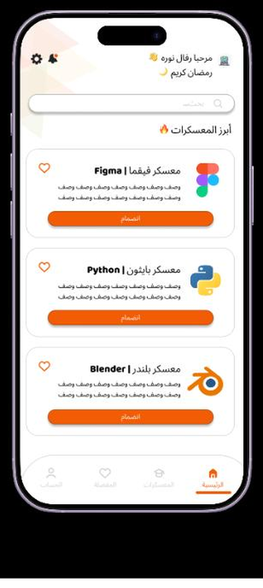

# UI/UX Design Portfolio

Mobile app interfaces designed in Figma. Both projects were done as part of a design program with the Jsoor (جسور) team.

---

## Game Tracker

A dark-themed mobile app for tracking your gaming backlog — what you're playing, what you've finished, what's on your wishlist, and what your friends are up to.

**[View the interactive prototype →](https://www.figma.com/proto/pCzqbw5kEq8CkOgWTsAewz/RafalNourah_Final?node-id=2-2&starting-point-node-id=2%3A2)**

### Design notes

- Six screens with a persistent four-tab bottom navigation (Profile · Discover · Search · Friends)
- Profile leads with a stats row (games, hours, currently playing, average rating), then groups the library into Currently Playing / Completed / Wishlist
- Discover splits into two tabbed states — *Upcoming* (release dates, genre tags, add-to-wishlist) and *Updates* (DLC, patches, expansions), each colour-coded by type
- Search uses a dense three-column cover grid so more of the catalogue is visible at once
- Friends shows presence (online dot), what each person is playing, and their trophy/hours stats

| Login | Profile | Discover — Upcoming |
|---|---|---|
|  |  |  |

| Discover — Updates | Search | Friends |
|---|---|---|
|  |  |  |

---

## Jsoor — 30-Day Challenge (جسور — تحدي الثلاثين يوم)

An Arabic-language learning app for a 30-day bootcamp challenge, covering tracks like Figma, Python, and Blender.

**[View the file →](https://www.figma.com/design/G0VkePmRt8eyht3uy4k44m/Untitled)**

### Design notes

- Fully right-to-left layout, designed in Arabic rather than translated from an LTR mockup
- Warm orange and white palette with a soft geometric pattern carried across every screen
- Home greets the user by name and surfaces featured bootcamps as cards with the tool's own logo, a description, and a join button
- Reusable components were built for buttons and course cards so the set stays consistent as tracks are added
- Four-tab bottom navigation (Home · Bootcamps · Favourites · Account)

| Home / Splash | Login | Courses |
|---|---|---|
|  |  |  |

---

## Tools

Figma — frames, components, auto layout, and interactive prototyping.
